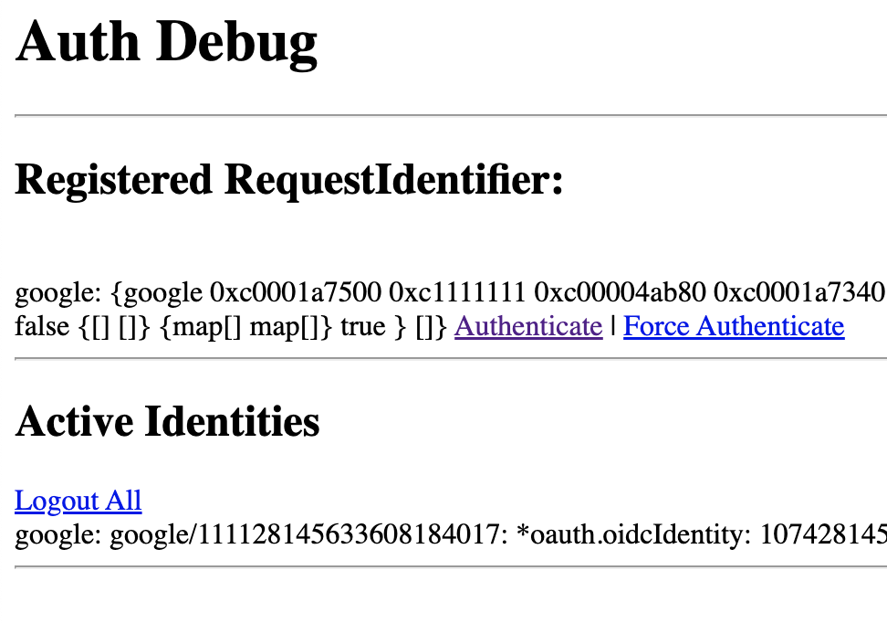

# About the example

This example uses Google as OIDC Provider.
To test it you need to create an application in the developer area of google.
See here for a description: https://developers.google.com/identity/openid-connect/openid-connect

# Run the example

Start the flamingo app and pass the CLIENTID and CLIENTSECRET as ENV variables:

`CLIENTID="4**********.apps.googleusercontent.com" && CLIENTSECRET="************_i4Z57XbhN20P4f" && go run main.go serve`

Then open http://localhost:3322

In the Debug view you can see the reqistered brokers and you can start the authentication:

http://localhost:3322/core/auth/debug

