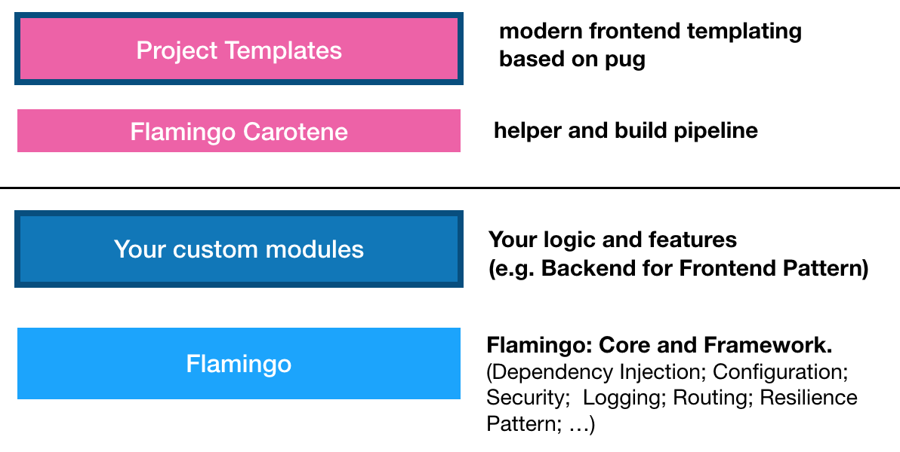

# Flamingo Project Structure

## Overview



## Project structure

A typical flamingo project looks like this:

```
projectName (Project Root)
│   main.go (The entry for your project)
│   README.md
│   Dockerfile
│   Makefile
│   (Jenkinsfile or other CI config)
│   Gopkg.lock
│   Gopkg.toml
│
└───config (Your project configuration)
│   └───config.yml (Main project config)
│   └───config_dev.yml (additional configs - e.g. this one is loaded for CONTEXT dev)
│   └───routes.yml (Routing config)
│   └───SUBFOLDER (Optional additional configuration context)
│          └───config.yml (Additional config for this context)       
│   
└───src (Project specific modules live here)
│   └───myModule (a module - see module structure below)
│
└───frontend (Frontend templates - if "flamingo-carotene" is used)
│   └───src (main frontend source / structure by atomic design)
│   │    └───atom (see flamingo-carotene)
│   │    └───molecule
│   │    └───...
│   └───dist (not part of VCS - will have frontend build result)

```

## Projects main.go

The Main executable should do:

* build the context tree for your project
* start the root command (delegate work to core/cmd package)

Depending on the activated flamingo modules in your project, you see a list of all available commands with
`go run main.go`

The main command is "serve" - so to run your project you normaly call:

`go run main.go serve`

## Configuration

A configuration context allows to run several different flamingo powered sites in one installation.
Typical usecases are localisations and/or specific subsites.

A Context represents:

* a list of modules for each context
* configurations (that are loaded from the coresponsing "config" folder)
* a baseurl: This is the first part of the URL - and its telling flamingo which context should be loaded.
* Contexts can be nested in a tree like structure - this allows you to inherit the properties of contexts from parents to childs

## Templating

Different Template Engines can be used to render content for the Web.   
Currently there are two available: „gotemplate“ and „pugtemplate“:

The „pug“ template engine comes with a standalone frontend build pipeline (based on webpack) that can be used. This is called „flamingo-carotene“

Learn more:

* [Pug Template Enginge](../3. Core Modules/Pug Template Engine.md)

## Examples

Different example projects are provided in seperate repositories.

