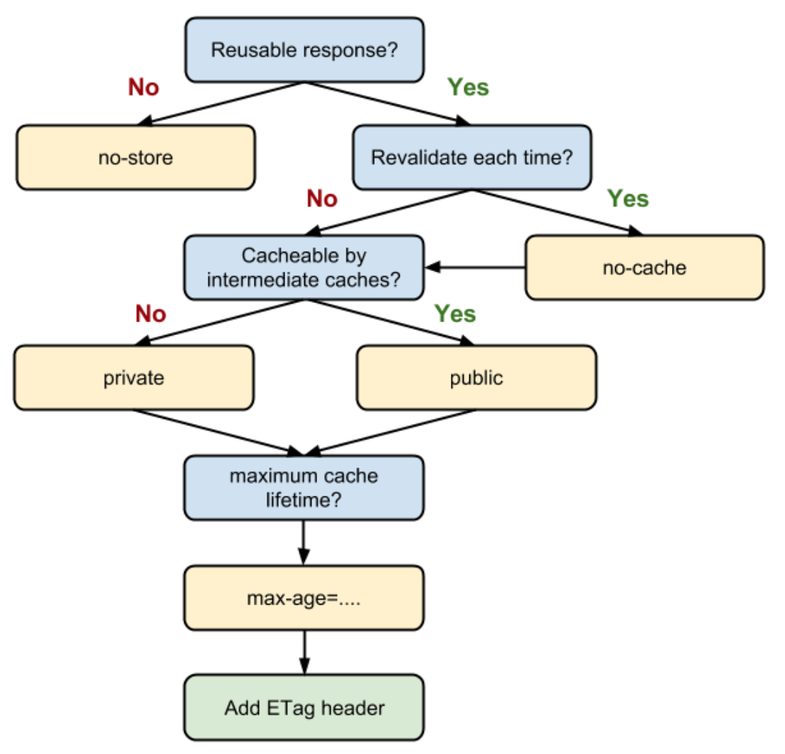

# Response

## HTTP Caching
In a controller you can set the CacheStrategy by setting CacheDirectives on the Default Response.

You can do this by using the CacheStrategy Helper like this:

```
	response := cc.responder.Render("checkout/review", viewData)
	response.CacheDirectives = web.NewCacheDirectiveBuilder().SetIsReusable(false).Build()
	return response
```

The CacheStrategy is build around this decision flow:



The image is taken from https://developers.google.com/web/fundamentals/performance/optimizing-content-efficiency/http-caching?hl=de

## Default Strategy

You can add the CacheStrategy Filter to your project. 
This filter will apply a default CacheStrategy for GET requests, if no CacheDirectives are set by the controller.

```
flamingo:
  web:
    filter:
      cachestrategy:
        default:
          revalidateEachTime: true
          isReusable: true
```