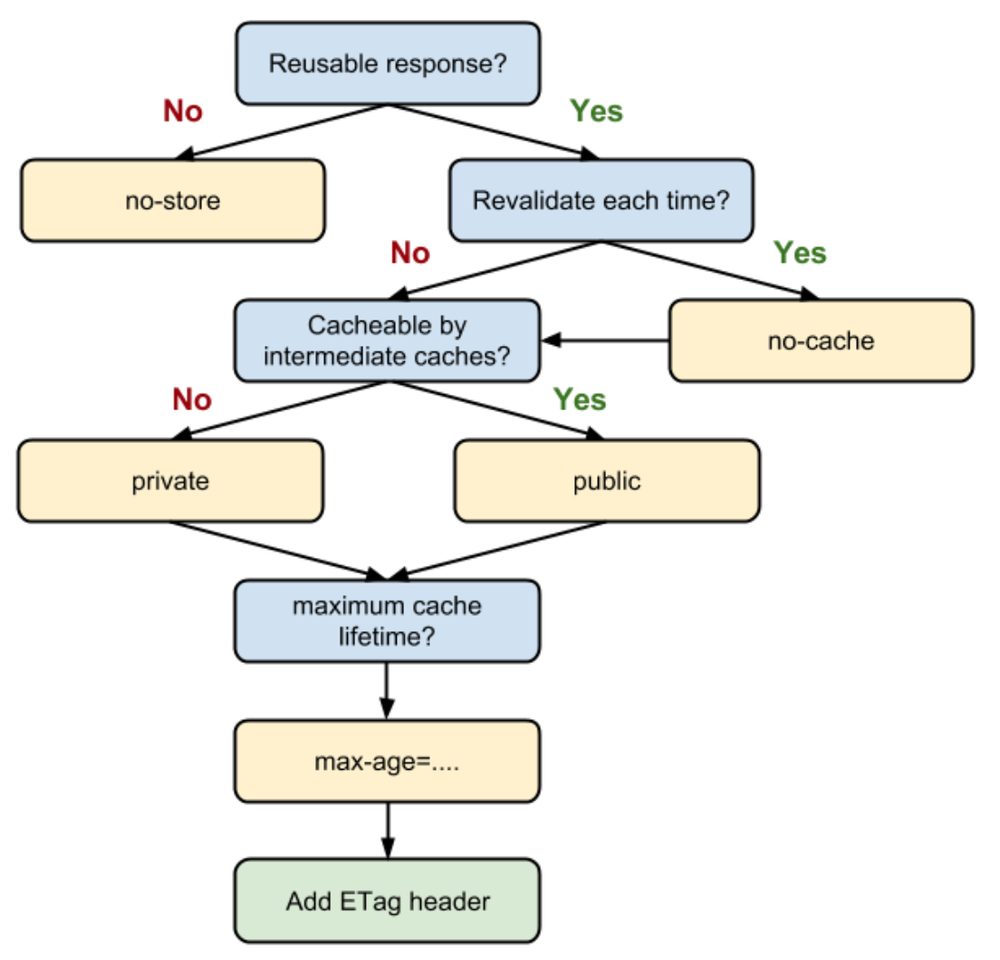

# Response

In your interface layer (e.g. in your controllers) you will normaly return a result that is some kind of response.

A response need to implement the generic "result" interface `Apply' function.

There are a couple of typical Responses available in Flamingo that you can access through the `web.Responder`.

The following example shows how you can use it and some typical Responder: 


```go
type (
	MyController struct {
        responder                    *web.Responder
    }
)


// Inject dependencies
func (mc *MyController) Inject(
	responder *web.Responder
) {
	cc.responder = responder
}


func (mc *MyController) MyAction(ctx context.Context, r *web.Request) web.Result {
	// Render response to render a template and optional pass template data. It is using the reigstered template enginge.
	mc.responder.Render("template",data)
	//Data response  - e.g. to return JSON
	mc.responder.Data(data)
	//Redirect to the given URL
	mc.responder.URLRedirect(url)
	//Redirect to a Flamingo handler (see Routing)
	mc.responder.RouteRedirect("flamingo.handler")
}

```

## HTTP Caching
In a controller you can also set the HTTP Cache directives on the Default Response.

You can do this by using the CacheDirectiveBuilder Helper like this:

```
	response := cc.responder.Render("checkout/review", viewData)
	response.CacheDirectives = web.NewCacheDirectiveBuilder().SetIsReusable(false).Build()
	return response
```

The CacheDirectiveBuilder is build around this decision flow:



The image is taken from https://developers.google.com/web/fundamentals/performance/optimizing-content-efficiency/http-caching?hl=de

## Default Strategy

You can add the CacheStrategy Filter to your project.
This filter will apply a default CacheStrategy for GET requests, if no CacheDirectives are set by the controller.

To add this filter, just add the Module to your bootstrap like this:

```go 
import (
	...
	"flamingo.me/flamingo/v3/framework/web/filter"
	...
)


func main() {
    ...
	... config.NewArea(
		"root",
		[]dingo.Module{
			...
            new(filter.DefaultCacheStrategyModule),
            ...
}
```


```yaml
flamingo:
  web:
    filter:
      cachestrategy:
        default:
          revalidateEachTime: true
          isReusable: true
```